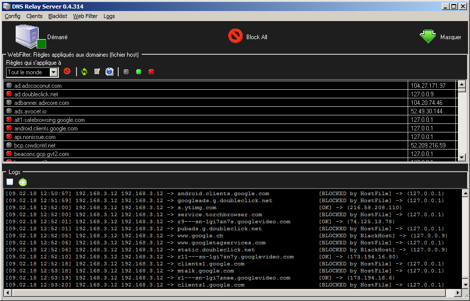

# DNS Relay Server

### Télécharger le setup d'installation Windows:

https://github.com/ddeeproton/DNSRelayServer-DelphiPython/raw/master/Setup%20installation/DNSRelayServerSetup.exe

### Télécharger les codes sources par version:

https://github.com/ddeeproton/DNSRelayServer-DelphiPython/raw/master/Sources

### Télécharger tous les codes sources:

https://github.com/ddeeproton/DNSRelayServer-DelphiPython/archive/master.zip

### Bug

Pour que le filtrage DNS puisse fonctionner, désactivez l'IPv6 dans les paramètres de vos cartes réseau (voir image).

### Compilation:

Compile avec:

-Delphi 7 

Téléchargez gratuitement Delphi 7 ici et si nécessaire, executez en mode admin le setup d'installation (Windows vous dira peut-être qu'il n'est pas compatible, mais ça marche quand-même). 

https://delphi.developpez.com/telecharger-gratuit/delphi7-perso/

Il vous faudra créer un compte chez developpez.com pour télécharger.

-Ne compile pas bien avec: 

Delphi 6 et versions antérieures

### Description:

"DNS Relay Server" est une application qui a pour but d'offrir un filrage sur les DNS.

L'idée est de proposer un firewall (un parfeu) sur la couche DNS.

### "DNS Relay Server" peut servir à:

-Bloquer les publicités

-Savoir ce que fait une machine sur Internet

-Contrôler s'il n'y a pas de virus / malware qui tente de communiquer.

-De bloquer les mises à jours obligatoires (dont certains sont normalement impossible à bloquer).

-De poser un filtrage parentale

-Accélérer votre connexion Internet (en gardant en cache les requêtes DNS)

-De moins soliciter le serveur DNS de votre FAI (grâce au cache) donc aspect "écologie" et "vie privée".

-De rajouter des noms de domaines à des IP d'un seul coup pour plusieurs machines (clients DNS). 

-De vous avertir en cas de déconnexion d'internet

-De bloquer la surveillance de Google, de Facebook et la NSA.

-et bien d'autre choses auquel je n'ai pas pensé ^^

### Avertissement:
Les versions 0.x signifient que vous êtes sur une version béta. Ce qui signifie qu'il peut y avoir des bugs et des fonctionnalités non-implémentées.  

Ce prorgamme est gratuit et le restera toujours. 

### Nouveautés :

Version 0.4.343 Ajout de Netstat:

Version 0.4.380 Remplacement du système d'alerte par des logs configurables

### Site web

https://dnsrelay.000webhostapp.com/